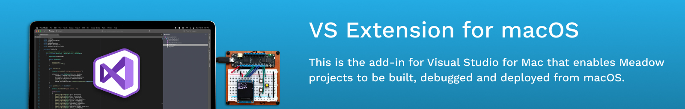

## Visual Studio for Mac support has reached end-of-life

Visual Studio for Mac has been retired as of August 31, 2024. As a result, **Wilderness Labs is no longer supporting the Visual Studio for Mac Meadow extension**.

However, this repo will remain open and pull requests from the community will be reviewed and merged. 

For Meadow development on Mac OS, Wilderness Labs recommends [JetBrains Rider](https://www.jetbrains.com/rider/) or [Visual Studio Code](https://code.visualstudio.com/). 

## Build Status 

## Installation 

To install the add-in:

### Install the latest version of [Visual Studio for Mac](https://visualstudio.microsoft.com/downloads/).

### Install the add-in from the extensions/add-ins manager: 
 1. open VS Mac, open the **Visual Studio** > **Extensions** menu and select the **Gallery** tab.
 2. Select **All repositories** and Search for `Meadow` (you may have to click the **Refresh** button).
 3. Select the Meadow extension and then click **install** on the right.
 4. Follow any additional installation instructions.

## Deploying the Add-in from Source

 1. Install the latest version of [Visual Studio for Mac](https://visualstudio.microsoft.com/downloads/).
 2. Install the **AddinMaker** maker from the extensions/add-ins manager (follow installation instructions above and search for `AddinMaker` instead).
 3. Clone the **Meadow.CLI** project from [GitHub](https://github.com/WildernessLabs/Meadow.CLI).
 4. Clone the **VS_Mac_Meadow_Extension** project from [GitHub](https://github.com/WildernessLabs/VS_Mac_Meadow_Extension)
 5. Open `VS4Mac_Meadow_Extension.sln` solution with VS Mac.
 6. Make sure all the nuget packages are restored and then start debugging, which will open a new instance of VS Mac that has the Add-in that just built enabled.

### Creating an Add-in Package

To create an addin package (`.mpack`), first, build the add-in in **release** mode, and then run the `CreateAddinPackage.sh` script from terminal.

To change or update the version number, edit the **Verion** in `/Properties/AddinInfo.cs`.

### Publishing 

(for Wilderness Labs publishing team)

To publish:
1. Go to [https://addins.monodevelop.com](https://addins.monodevelop.com)
2. Sign in
3. Select **WildernessLabs.Meadow** project under **My Projects** (upper right)
4. Scroll to the bottom of the page and click the **Upload Package** button
5. Click the **Choose File** button and select the new `.mpack` file on your local machine
6. Set the **Target version** to the current **stable** release of Visual Studio for Mac (e.g. 8.8.4)
7. Click the **Upload** button
8. Find the package you just uploaded by searching for the VS4Mac version number you chose 
9. Cick the **Publish** button

## Nugets (For creating Meadow Applications)

## License

Released under the [Apache 2 license](license.md).

## Authors

Bryan Costanich, Adrian Stevens, Brian Kim, Dominique Louis
